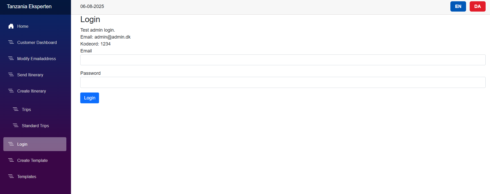

# TANA - Travel Management System
> Professional travel booking and itinerary management platform

## 🎯 Overview
TANA is a comprehensive travel management system built with ASP.NET Core 8.0 and Clean Architecture. Designed for travel agencies to manage bookings, create custom itineraries, and generate professional travel documents.

## ✨ Key Features
- **Travel Management**: Create and manage tours, customers, and bookings
- **PDF Generation**: Professional travel itinerary documents with QuestPDF
- **Multi-language**: English/Danish support with localization
- **Security**: Session-based authentication and authorization
- **Templates**: Customizable report layouts and travel plan templates
- **Responsive UI**: Modern Blazor Server interface with Bootstrap

## 🛠️ Technology Stack
- **Backend**: ASP.NET Core 8.0, Clean Architecture, CQRS Pattern
- **Frontend**: Blazor Server, Bootstrap, JavaScript
- **Database**: Entity Framework Core, SQL Server/LocalDB
- **Security**: Custom authentication, session management
- **DevOps**: Docker support, multi-environment configuration
- **PDF**: QuestPDF for document generation

## 🏗️ Architecture
```
TANA/
├── TANA.API/          # RESTful API with Swagger documentation
├── TANA.Web/          # Blazor Server application
├── TANA.Domain/       # Domain entities and business rules
├── TANA.Application/  # CQRS commands/queries and DTOs
├── TANA.Infrastructure/ # External services (Email, PDF)
└── TANA.Persistence/  # EF Core repositories and data access
```

## 📸 Screenshots

### Login & Authentication


### Customer Dashboard


### Create Travel Itinerary


### Template Builder


### Standard Tours Management


## 🚀 Quick Start

### Prerequisites
- .NET 8.0 SDK
- SQL Server LocalDB

### Setup
```bash
# Clone repository
git clone https://github.com/AmjadRenno/TANA-Travel-Management.git
cd TANA-Travel-Management

# Restore packages
dotnet restore

# Update database
dotnet ef database update --project TANA.Persistence --startup-project TANA.Web

# Run application
dotnet run --project TANA.Web
```

**Access**: https://localhost:62778  
**Admin Login**: admin@admin.dk

## 🔧 Development Features
- **Clean Architecture**: Clear separation of concerns
- **CQRS Pattern**: Scalable command/query separation  
- **Repository Pattern**: Testable data access layer
- **Dependency Injection**: Loosely coupled components
- **Docker Ready**: Full containerization support

## 📄 License
Educational project - Third Semester University Assignment

## ⚖️ Disclaimer
This is a educational project developed for university coursework. The "TANA" name is used for demonstration purposes only and is not affiliated with any real business entity. This project is intended solely for learning and portfolio demonstration.
